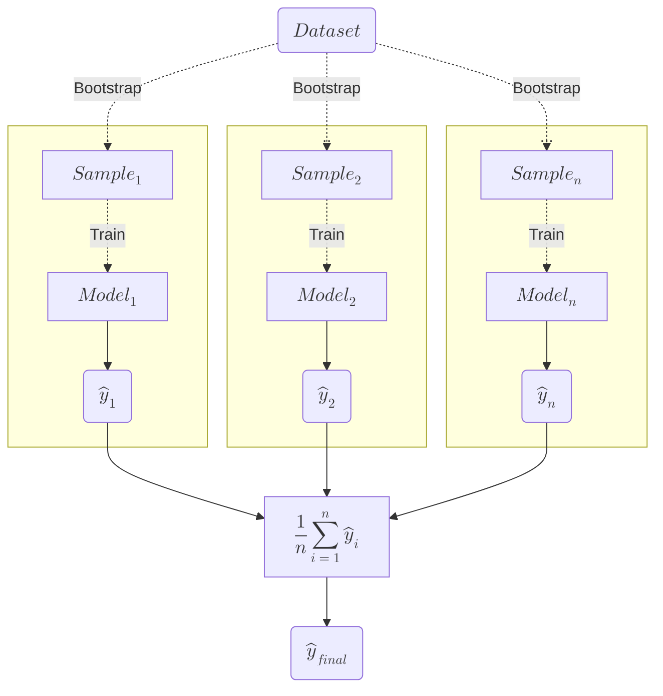

---

`````ad-quote
title:  

```ad-quote
title:
###### Mermaid
```  

````ad-quote
title:  

```mermaid

graph TD
11($$Dataset$$)
subgraph .
121[$$Sample_1$$]
131[$$Model_1$$]
141("$$\hat{y}_1$$")
121 -.->|Train| 131
131 --> 141
end

subgraph ..
122[$$Sample_2$$]
132[$$Model_2$$]
142("$$\hat{y}_2$$")
122 -.->|Train| 132
132 --> 142
end

subgraph ...
12n[$$Sample_n$$]
13n[$$Model_n$$]
14n("$$\hat{y}_n$$")
12n -.->|Train| 13n
13n --> 14n

end

11 -.->|Bootstrap| 121
11 -.->|Bootstrap| 122
11 -.->|Bootstrap| 12n

141 --> 15
142 --> 15
14n --> 15

15["$$\frac{1}{n}\sum_{i=1}^{n}\hat{y}_i$$"]
15 --> 16
16("$$\hat{y}_{final}$$")
```
````
`````

Random Forest